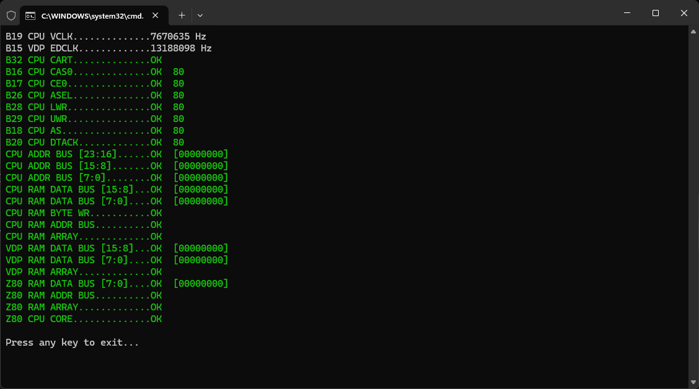

<p align="center">

&#x20;   

</p>

MegaDoctor turns the Mega EverDrive PRO/CORE cartridge into a diagnostic tool for troubleshooting Sega Mega Drive / Genesis consoles. The diagnostic ROM is designed to operate even under severe hardware failure conditions, such as faulty RAM or missing CPU signals on the cartridge bus.

Even if the diagnostic ROM cannot boot, MegaDoctor can still work in passive mode by monitoring bus signals and providing useful low-level information for hardware diagnostics and fault analysis.

To start diagnostics, insert the cartridge into the console, connect it to a PC via USB, power on the console, and run `megadoctor.exe`.

## Repository contents

* `app-md`
  Source code of the diagnostic ROM for Mega Drive / Genesis.

* `app-pc`
  Source code of the USB utility used to start diagnostics and display diagnostic results.

* `dist`
  Prebuilt project files ready to use.

* `fpga`
  Source code of the custom mapper for Mega EverDrive PRO/CORE.

* `dist.bat`
  Collects project files and packages them into the `dist` directory.

## Test modes

MegaDoctor provides two test modes: `cart0` and `cart1`.

To start diagnostics in `cart0` mode, run:

```text
megadoctor.exe
```

To start diagnostics in `cart1` mode, run:

```text
megadoctor.exe cart1
```

The `cart1` mode launches the diagnostic ROM in the Mega-CD BIOS address space. This mode is intended for systems with a faulty `B32 (CART)` signal.

On many clone consoles based on TA-series chips, the `B32` signal generated by the `TA-04` IC is a common failure point. The `cart1` mode can help identify this problem.

If the console does not boot in `cart0` mode, the diagnostics reports an error in the `B32 CPU CART` field, but the system successfully starts in `cart1` mode, this is a strong indication that the `B32` signal is defective.

The `cart1` mode also bypasses the TMSS ROM startup sequence. This may be useful on systems with faulty RAM, since it is unclear whether the TMSS program itself can always execute correctly and transfer control to the diagnostic ROM when the main CPU RAM is defective.

## Notes

Keep in mind that failures in one subsystem may affect the operation of others. For example, a faulty Z80 CPU can interfere with the M68000 bus because both processors share the bus through a bus arbiter.

Because of this, the diagnostics should not be considered a guaranteed way to identify the exact source of a hardware failure in every case. However, it provides very useful clues and greatly simplifies fault analysis and troubleshooting.


<p align="center">

&#x20;   

</p>
